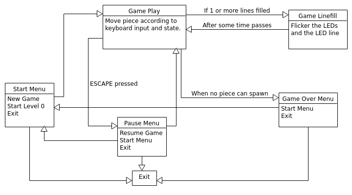

# Semestral Project for APO
## Authour
Vojtěch Tilhon
tilhovoj@fel.cvut.cz
## Goal and Description of the Project
Create a clone of the famous Tetris game for MZ_APO using distant access.
The application uses raw mode stdin input over SSH to control the game,
LED lights and the LED display line rapidly flicker when the player clears a line.
## Compilation
The C code can be compiled by running the Makefile in the repository.
The run command of the Makefile connects to the MZ_APO board with IP address
specified by TARGET_IP variable over SSH and executes the application.
## Controls
The application starts in the start menu phase. By pressing up and down arrows,
you can navigate the menu. The 'Start Level' can be changed by pressing left and right
arrows when selected. The enter key executes the seleceted menu choice. When in game,
the left and right arrows move the currently active tetromino. The up arrow rotates it.
The down arrow forces a soft drop to happen and space bar hard drops the piece.
Escape brings up the pause menu, which allows the user to exit or return to
the start menu. When the game is over, a game over menu appears which prompts
the user to either return to the start menu or exit.
## The Block Schema

